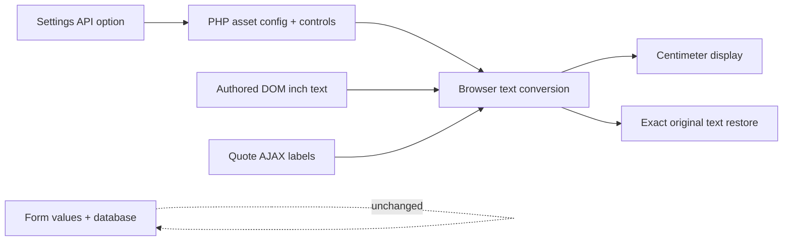

# Architecture

PHP registers a single Settings API option, frontend assets, menu-item filter, shortcode, and footer output. Browser JS performs conservative text-node detection, stores exact originals, synchronizes controls, and observes asynchronously inserted/replaced content. WordPress HTML and stored data remain in their authored units.

No database tables, conversion endpoint, remote API, or external runtime dependencies. Preference is browser-local only. DOM observer disconnects for its own writes to avoid conversion feedback loops. Header/menu and footer fallback mounting is presentation-only; builder source is not edited.
