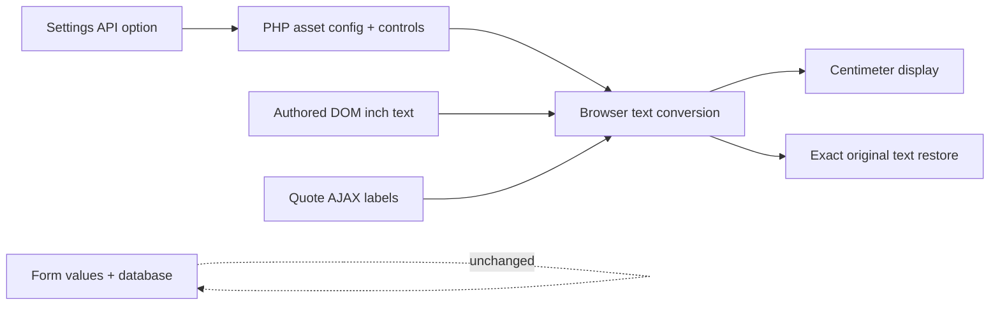

# Architecture

PHP registers a single Settings API option, frontend assets, menu-item filter, shortcode, and footer output. Browser JS performs conservative text-node detection, stores exact originals, synchronizes controls, and observes asynchronously inserted/replaced content. WordPress HTML and stored data remain in their authored units.

No database tables, conversion endpoint, remote API, or external runtime dependencies. Preference is browser-local only. DOM observer disconnects for its own writes to avoid conversion feedback loops. Header/menu and footer fallback mounting is presentation-only; builder source is not edited.

## Admin live preview (0.1.1)

Only the plugin settings-page hook enqueues WordPress's bundled `wp-color-picker`, the shared frontend button stylesheet, and settings-only JS/CSS. The sitewide converter never executes in admin. Appearance inputs carry allowlisted `data-css-var` bindings; the preview script writes these variables only onto `#puc-preview`, not the document root. Picker change callbacks use Iris's colour value immediately before its text input updates, then refresh other controls. Native picker inputs remain accessible through the Select Color button.

Preview buttons simulate unit changes on a fixed example without reading or writing visitor preference. Mock placement controls use their own attributes rather than real frontend toggle bindings. No AJAX, REST request, localStorage write, or automatic Settings API save occurs during preview. Invalid colours keep the last valid sample and show validation help. Existing strict server sanitization and normal Save Changes remain the persistence boundary.
