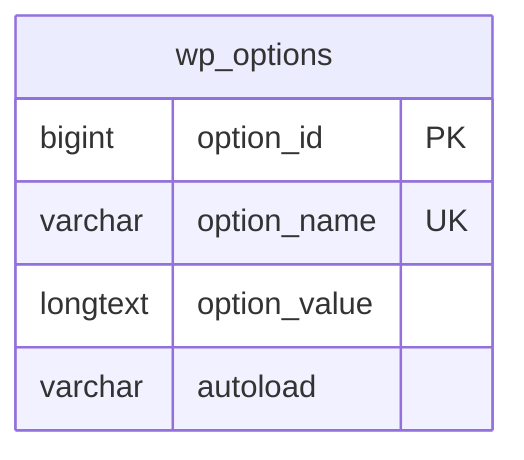

# Storage schema

No custom tables or schema migrations. Activation adds a default WordPress option only if absent; rollback deactivates the plugin, and uninstall deletes its disposable option. Existing catalog and quote data are not touched.

`puc_settings`: enabled, floating, header, footer, remember (literal booleans represented as 0/1); default_unit (in/cm); decimals (0–3); position (four corner allowlist); header_location (registered menu-location allowlist); header_selector and footer_selector (bounded selector strings); background and foreground color fields; radius and floating offset (bounded integers). Exact field names and defaults are defined in `PUC_Settings::defaults()`. No foreign keys or cascade rules.

Browser key `puc_unit`: in/cm visitor preference. No personally identifying data, cookies, or server profile. Temporary browser QA sessions live outside the repository and are revoked after testing.
