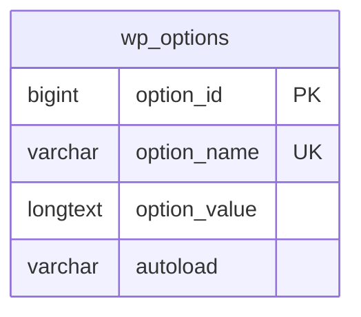

# Storage schema

No custom tables or schema migrations. Activation adds defaults only if `puc_settings` is absent. Deactivation reverses the frontend enhancement; uninstall deletes only this disposable option. Catalog data, Brizy metadata, and quote records are not touched.

## `wp_options` row `puc_settings`

Serialized WordPress option managed through the Settings API. Every key is non-null and resolved against defaults; unknown keys are discarded. No additional indexes, foreign keys, or cascade rules.

| Key | Type / allowed values | Default |
|---|---|---|
| enabled | integer 0 or 1 | 1 |
| floating | integer 0 or 1 | 1 |
| header | integer 0 or 1 | 0 |
| footer | integer 0 or 1 | 0 |
| remember | integer 0 or 1 | 1 |
| default_unit | in, cm | in |
| decimals | integer 0–3 | 1 |
| position | top-left, top-right, bottom-left, bottom-right | bottom-right |
| header_location | registered non-footer menu location, or empty for DOM fallback | menu_1 when registered |
| header_selector | bounded plain CSS selector, maximum 200 bytes | empty |
| footer_selector | bounded plain CSS selector, maximum 200 bytes | empty |
| background_color | strict six-digit hex color | #173942 |
| text_color | strict six-digit hex color | #ffffff |
| radius | integer 0–100 px | 8 |
| floating_offset | integer 0–200 px | 20 |
| label_in | nonempty plain-text string, maximum 60 Unicode characters | Units: in |
| label_cm | nonempty plain-text string, maximum 60 Unicode characters | Units: cm |

Boolean settings accept only literal integer `1` or string `"1"` as enabled. Browser key `puc_unit` stores only `in` or `cm`; no identifying data, preference cookies, or server profile. Implicit option values may be pinned to their original strings in the DOM so display labels cannot change form submissions.

No seed data is required: activation initializes settings idempotently. No forward/reverse schema migration is needed because this does not modify database structure. Temporary browser QA sessions are kept outside the repository and revoked after verification.

## 0.1.1 appearance update

Native colour pickers and the live preview reuse exactly these existing keys. No new options, columns, tables, defaults, or migrations were added. Previewing writes only local DOM styles; persistence still occurs solely through Save Changes and the Settings API.

## 0.1.2 label update

Two keys extend the same serialized option. Forward upgrade resolves absent keys to the original button wording without updating existing saved values; the next normal settings save persists them. Blank, non-string or unusable input falls back to defaults; tags are stripped, whitespace normalized and Unicode text bounded. Reverse upgrade to 0.1.1 ignores these keys, leaving all existing settings usable. No database structural migration, new option namespace, seed data or content rewrite is required.
